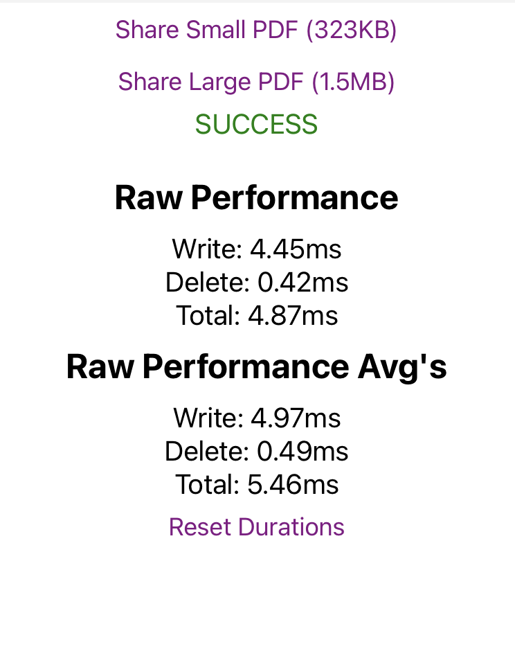

# PDF BASE64 Example

Example application for testing basic performance of persisting base64 PDF files to the file system using [react-native-fs](https://github.com/itinance/react-native-fs).



# Perquisites
- [React Native - Environment Setup](https://reactnative.dev/docs/environment-setup)

```bash
yarn install --frozen-lockfile
```

### Android

```bash
yarn android
```

### iOS

```bash
cd ios && pod install && cd ..
yarn ios
```
# Generating Random PDF

You can generate a random PDF for testing with the following script.

Note the sizing won't be exact but it will get you in the ballpark! ⚾️

```bash
# Required for the script
brew install wkhtmltopdf

yarn generate:pdf ${byte_size}
```
